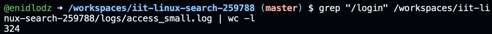
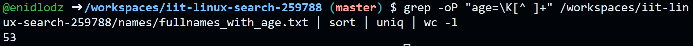
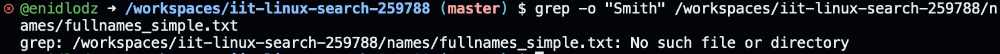
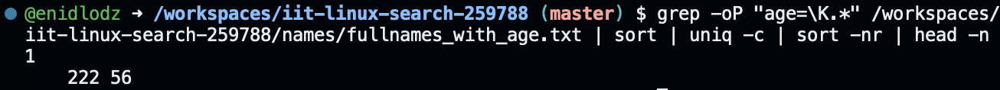
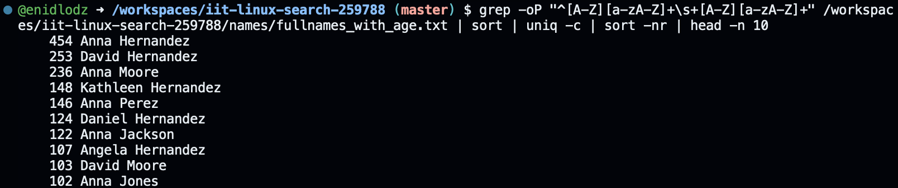
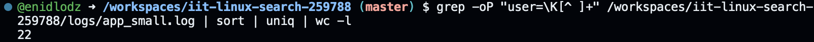
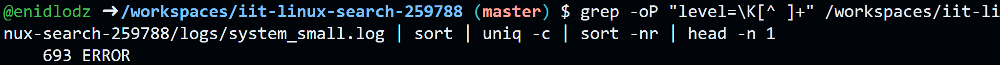
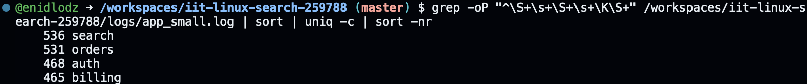
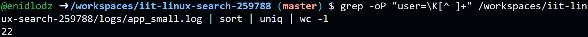

> This is the demonstration how to use Linux commands to process strutured text data.

### 0. How many lines are in fullnames_with_age.txt?

Put screenshot from Codespaces illustrating the result here.
Correct screenshot should contain your github username in the shell, a command and the result.

Example:

**Explanation** Write the explanation why the specific command was used.

Example: wc command is to count data in a given file. -l parameter is for counting lines.

### 1. How many lines in access_small.log have path /login?

**Explanation**

`grep "/login"` grabs all the lines with `/login` in them.
`wc -l` counts all the lines (note `-l` flag for lines)

### 2. How many occurrences of Smith are in fullnames_with_age.txt?

**Explanation**

`grep -o "Smith` shows only exact matching parts of the search
`wc -l` counts all the lines (note `-l` flag for lines)

### 3. How many occurrences of Smith are in fullnames_simple.txt?

**Explanation** 

`grep -o "Smith` shows only exact matching parts of the search
`wc -l` counts all the lines (note `-l` flag for lines)
Ideally a file would exist, but this would work if one did.

### 4. Which age is most frequent in fullnames_with_age.txt?

**Explanation**

`grep -oP "age=\K.*"` grabs lines that match the Perl-compatible regex pattern (`-p`), grab only the pattern word (`age=19`, `age=30`, etc). `\K` acts as a meta return, shifting the start of the returned string to that position (`age=19` becomes `19`, `age=30` becomes `30`, etc.). `.*` indicates "any character (`.`) any times (`*`) until whitespace".
The first `sort` arranges everything in order.
`uniq -c` counts all the occurences and returns the count in front of the value. Without the initial `sort`, `uniq -c` does not work properly.
`sort -nr` sorts numerically (`-n`) by the first value, and then reverses the order (`-r`) from increasing to decreasing.
`head -n 1` grabs the first (`-n 1`) line from the returned value.

### 5. Show the 10 most common names (first+last) in fullnames_with_age.txt.

**Explanation**

`grep -oP "^[A-Z][a-zA-Z]+\s+[A-Z][a-zA-Z]+"` returns only the string matching the Perl-compatible regex expression given. `^` sends the "cursor" to the beginning of the line, `[A-Z][a-zA-Z]+` finds any word that starts with a capital, `\s` adds a whitespace to the searched string, and the process is repeated for the surname. `+` is a "greedy" regex token, repeating the previous match as many times as possible.
The first `sort` arranges everything in order.
`uniq -c` counts all the occurences and returns the count in front of the value. Without the initial `sort`, `uniq -c` does not work properly.
`sort -nr` sorts numerically (`-n`) by the first value, and then reverses the order (`-r`) from increasing to decreasing.
`head -n 10` grabs the first ten (`-n 10`) lines from the returned value.

### 6. How many unique users are in app_small.log?

**Explanation**

`grep -oP "user=\K[^ ]+"` returns only the matching string (`-o`) after `=` (`\K`), finds any non-space character (`[^ ]`) as many times as it can (`+`). `-P` for PCRE.
`sort` sorts the returned data.
`uniq` grabs only the unique occurences of the users. Without `sort`, `uniq` does not work properly.
`wc -l` counts the returned lines (note `-l` flag for lines).

### 7. Which status code appears most often in access_medium.log? 

**Explanation**

`grep -oP "action=\K[^ ]+"` returns only the matching string (`-o`) after `=` (`\K`), finds any non-space character (`[^ ]`) as many times as it can (`+`). `-P` for PCRE.
The first `sort` arranges everything in order.
`uniq -c` counts all the occurences and returns the count in front of the value. Without the initial `sort`, `uniq -c` does not work properly.
`sort -nr` sorts numerically (`-n`) by the first value, and then reverses the order (`-r`) from increasing to decreasing.

### 8. What is the top 3 most common modules in app_small.log?

**Explanation**

`grep -oP "^\S+\s+\S+\s+\K\S+"` uses a chain of PCRE expressions (`-P`). `^` moves the "cursor" to the start of the line. `\S+\s+` finds as many non-whitespace (`\S`) characters as it can (`+`) and then as many _whitespace_ (`\s`) characters as it can (`+`). We repeat this twice (obtaining `^\S+\s+\S+\s+`), and then start (`\K`) our returned value at the next set of non-whitespace characters (`\S+`), effectively obtaining the third column in a line.
Doing it this way has poor human readability, but avoids the issues that using `awk {print $3}` causes, arising from double-spacing in some lines.
The first `sort` arranges everything in order.
`uniq -c` counts all the occurences and returns the count in front of the value. Without the initial `sort`, `uniq -c` does not work properly.
`sort -nr` sorts numerically (`-n`) by the first value, and then reverses the order (`-r`) from increasing to decreasing.

### 9. Which task appears most often in system_small.log?

**Explanation**

`grep -oP "task=\K[^ ]+"` returns only the matching string (`-o`) after `=` (`\K`), finds any non-space character (`[^ ]`) as many times as it can (`+`). `-P` for PCRE.
The first `sort` arranges everything in order.
`uniq -c` counts all the occurences and returns the count in front of the value. Without the initial `sort`, `uniq -c` does not work properly.
`sort -nr` sorts numerically (`-n`) by the first value, and then reverses the order (`-r`) from increasing to decreasing.
`head -n 1` grabs the first (`-n 1`) line from the returned value.